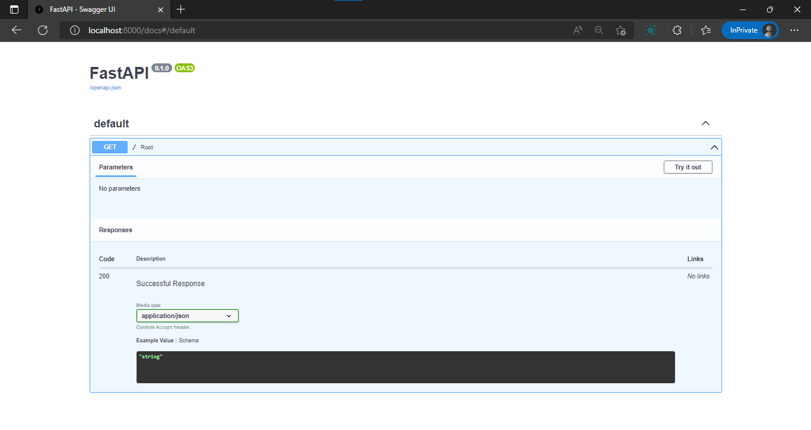

# 2. First Step.

Create a new folder for FastAPI app.
```bash
mkdir <Your APP Name>
```

Create main.py file inside you app.

This is the simple API code.
```python
from fastapi import FastAPI #FastAPI Module.

app = FastAPI() # app is the instance of FastAPI Class.


@app.get("/") # Root endpoint of the app.
async def root():
    return {"message": "Hello World"}
```
Paste the above code to main.py

Run live server using
```bash
uvicorn <app_name>.<main_file_name>:<fastAPI_instance> --reload
```
e.g.
```bash
uvicorn app.main:app --reload
```

Open your browser with http://localhost:8000 address.

It will show 
```json 
{"message":"Hello World"}
```

## FastAPI Swagger
Access swagger using http://localhost:8000/docs

