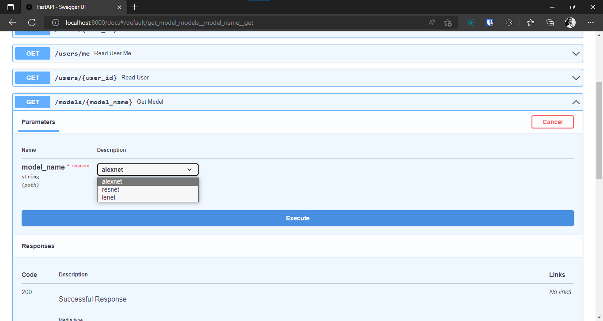

# 3. Path Parameters.

We can create routes with parameters.
```python
from fastapi import FastAPI

app = FastAPI()


@app.get("/items/{item_id}") # Routes can accept dynamic parameter.
async def read_item(item_id):
    return {"item_id": item_id}
```

To run this endpoint goto http://localhost:8000/items/test.

Output
```
{"item_id":"test"}
```

## Path parameters with types

```python
from fastapi import FastAPI

app = FastAPI()


@app.get("/items/{item_id}")
async def read_item(item_id: int): # item_id should be integer type.
    return {"item_id": item_id}
```

To run this endpoint goto http://localhost:8000/items/4.

Output
```
{"item_id":4}
```

## Order matters

To resolve similar type of path sequnce will matter.

```python
from fastapi import FastAPI

app = FastAPI()


@app.get("/users/me") # This route should be on the top so it me doesn't count as user_id as path parameter.
async def read_user_me():
    return {"user_id": "the current user"}


@app.get("/users/{user_id}")
async def read_user(user_id: str):
    return {"user_id": user_id}
```

## Predefined values

```python

from enum import Enum

from fastapi import FastAPI


class ModelName(str, Enum):
    alexnet = "alexnet"
    resnet = "resnet"
    lenet = "lenet"


app = FastAPI()


@app.get("/models/{model_name}")
async def get_model(model_name: ModelName): # model_name will only accept alexnet, resnet, lenet as path parameter.

# model_name.value can be used to get the value.
    if model_name == ModelName.alexnet:
        return {"model_name": model_name, "message": "Deep Learning FTW!"}

    if model_name.value == "lenet":
        return {"model_name": model_name, "message": "LeCNN all the images"}

    return {"model_name": model_name, "message": "Have some residuals"}

```

output.




